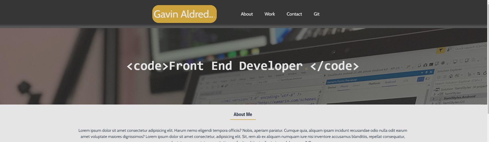

# <Gavin-Aldred-Portfolio-Project>
## Description

A portfolio of work to showcase my skills and talents to employers. Also using techniques recently learned, such as flexbox, CSS grid, media queries, and CSS variables.
Uses flexbox, grid method, positioning, and media queries. Follows semantic HTML best practice and uses comments to guide CSS reading.
Some CSS tricks were used to produce gradients, animations, and a hamburger menu.

## Installation

N/A

## Usage

View the completed project below on the deployed link. A screenshot has also been added.

 
  

   

[Link to the finished deployed website](https://github.com/gavinaldred/my-portfolio)

## Credits

N/A

## License

Please refer to the LICENSE in the repo.

---

## Badges

